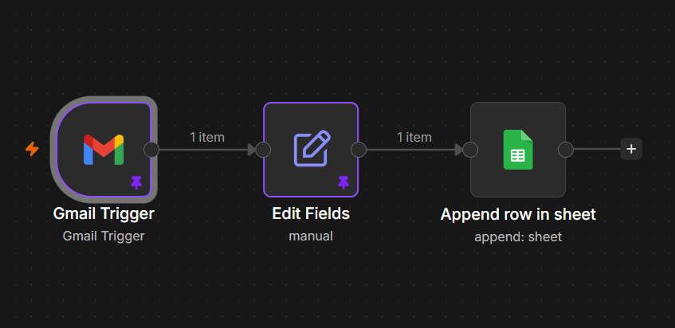

# 🚀 Automated Expense Tracker

> Automatically track expenses from Gmail transaction emails using n8n and Google Sheets.



\# Automated Expense Tracker


An n8n-based automation that extracts expense information from Gmail transaction emails and automatically records it in Google Sheets.


\## How It Works


Gmail Transaction Email

&#x20;       ↓

Gmail Trigger

&#x20;       ↓

Edit Fields

&#x20;       ↓

Google Sheets


\### Workflow


1\. \*\*Gmail Trigger\*\*

&#x20;  - Monitors incoming Gmail messages.

&#x20;  - Detects transaction emails.


2\. \*\*Edit Fields\*\*

&#x20;  - Extracts the transaction subject.

&#x20;  - Extracts the numeric expense amount using a regular expression.

&#x20;  - Generates the current date/time.


3\. \*\*Google Sheets\*\*

&#x20;  - Appends the processed expense to a Google Sheet.


\## Example


Input email subject:


`₹500 debited from your account`


The workflow extracts:


| Field | Value |

|---|---|

| Date | Current date/time |

| Amount | 500 |

| Description | ₹500 debited from your account |


\## Tech Stack


\- n8n

\- Gmail

\- Google Sheets

\- JavaScript Expressions

\- Regular Expressions


\## Setup


1\. Install and run n8n.

2\. Import `automated-expense-tracker.json`.

3\. Create your own Gmail OAuth credential.

4\. Create your own Google Sheets OAuth credential.

5\. Select your Gmail account.

6\. Select your Google Spreadsheet and worksheet.

7\. Configure the required column mappings.

8\. Activate the workflow.


\## Important


The workflow JSON included in this repository is a sanitized, reusable version.


It does not contain the original Google account credentials or personal spreadsheet connection.


Users must configure their own Gmail and Google Sheets credentials before running the workflow.


\## Workflow Structure


```text

Gmail Trigger → Edit Fields → Google Sheets

