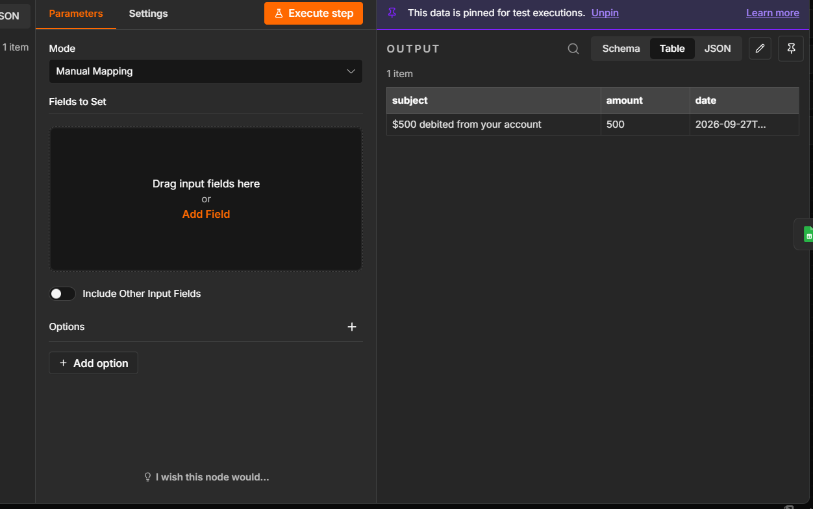
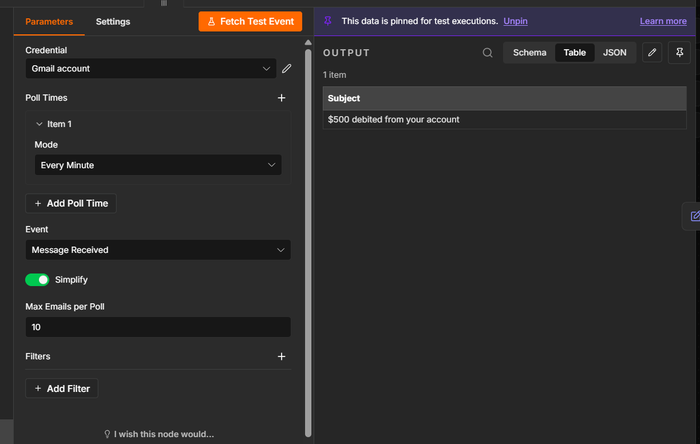
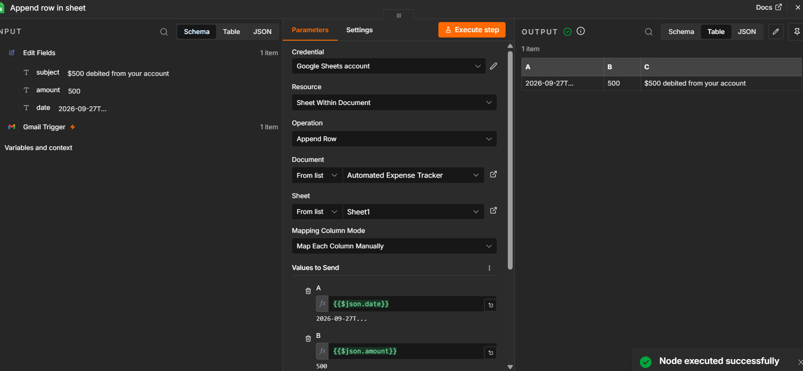

# 🚀 Automated Expense Tracker

> Automatically track expenses from Gmail transaction emails using n8n and Google Sheets.

## 📌 Project Overview

This project automates personal expense tracking using n8n.

Instead of manually entering every transaction into a spreadsheet, the workflow monitors Gmail transaction emails, extracts the transaction amount and details, and automatically records them in Google Sheets.

### 🔄 Workflow

Gmail Transaction Email  
↓  
Gmail Trigger  
↓  
Edit Fields  
↓  
Google Sheets

### 🛠️ Tech Stack

- n8n
- Gmail
- Google Sheets
- JavaScript Expressions
- Regular Expressions

## 📸 Screenshots

### Gmail Trigger

### Data Processing

### Google Sheets Output

## ⚙️ Technical Implementation

### 1. Gmail Trigger

The workflow uses the Gmail Trigger node to monitor incoming transaction emails.

### 2. Data Processing

The Edit Fields node processes the incoming email data.

The transaction amount is extracted from the email subject using a regular expression.

Example:

`₹500 debited from your account`

→ `500`

The workflow also captures the transaction description and current date/time.

### 3. Google Sheets

The processed data is mapped into Google Sheets:

| Field | Source |
|---|---|
| Date | Current date/time |
| Amount | Extracted transaction amount |
| Description | Gmail subject |

### Example Output

| Date | Amount | Description |
|---|---:|---|
| Current date/time | 500 | ₹500 debited from your account |

## 🚀 Setup

### Prerequisites

- n8n
- Gmail account
- Google Sheets account

### Installation

1. Download or clone this repository.
2. Open n8n.
3. Import the workflow JSON file.
4. Connect your own Gmail credentials.
5. Connect your own Google Sheets credentials.
6. Select your Google Spreadsheet and worksheet.
7. Verify the column mappings.
8. Activate the workflow.

> **Note:** This repository contains a reusable workflow template. Personal Gmail, Google Sheets, and OAuth credentials are not included.

## 🎯 Project Output

The workflow automatically adds detected transaction details to Google Sheets.

Example:

| Date | Amount | Description |
|---|---:|---|
| 2026-09-27 | ₹500 | ₹500 debited from your account |

This eliminates the need to manually enter each transaction into a spreadsheet.

## 🔮 Future Improvements

- Support multiple transaction email formats
- Automatically categorize expenses such as Food, Travel, Shopping, and Bills
- Add monthly and weekly expense summaries
- Create dashboards for expense visualization
- Add support for multiple bank accounts
- Use AI-based classification for transaction categories

## 💡 Key Learning

This project helped me understand how workflow automation can connect different services and reduce repetitive manual tasks.

I learned how to work with Gmail triggers, data transformation, JavaScript expressions, regular expressions, OAuth authentication, and Google Sheets automation.
